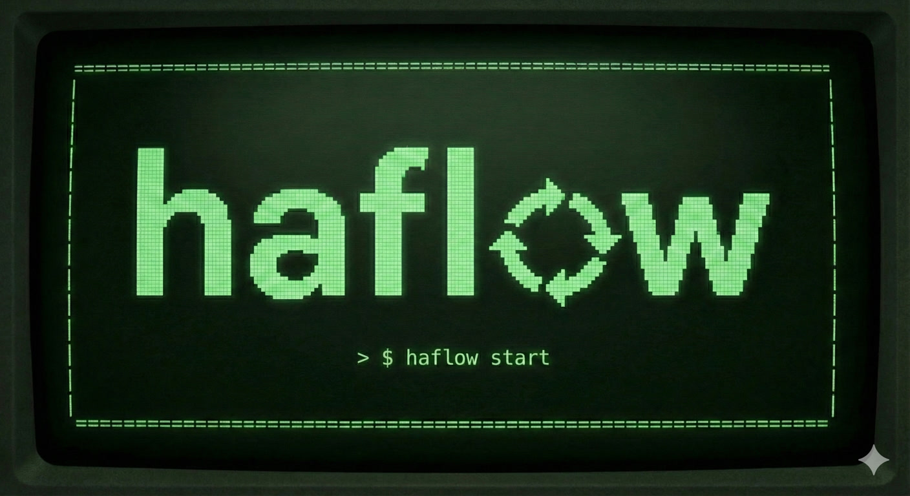

# haflow (Human Agent flow) [WIP!]



**A web-based control panel for AI agents in your local development cycle.**

Launch missions, monitor agent progress in real-time, and approve outputs at human gates—all from a browser UI. Agent steps run in isolated Docker containers.

## 🌐 Why Web-Based?

- **Dashboard view** of all missions and their status
- **Mobile access** via [Tailscale](https://tailscale.com/) while AFK
- **Remote deployment** on a VPS
- **Team visibility** for shared mission observation

## 📋 Requirements

- Node.js >= 18.0.0
- pnpm >= 10.x
- Docker

## 🚀 Quick Start

```bash
pnpm install
pnpm --filter @haflow/shared build
pnpm --filter @haflow/backend dev   # port 4000
pnpm --filter frontend dev          # port 5173
```

## 🧰 CLI

```bash
pnpm --filter @haflow/cli build
pnpm add -g /home/s-linux/projects/haflow/packages/cli

haflow init
haflow link /path/to/project
haflow start
haflow status
```
